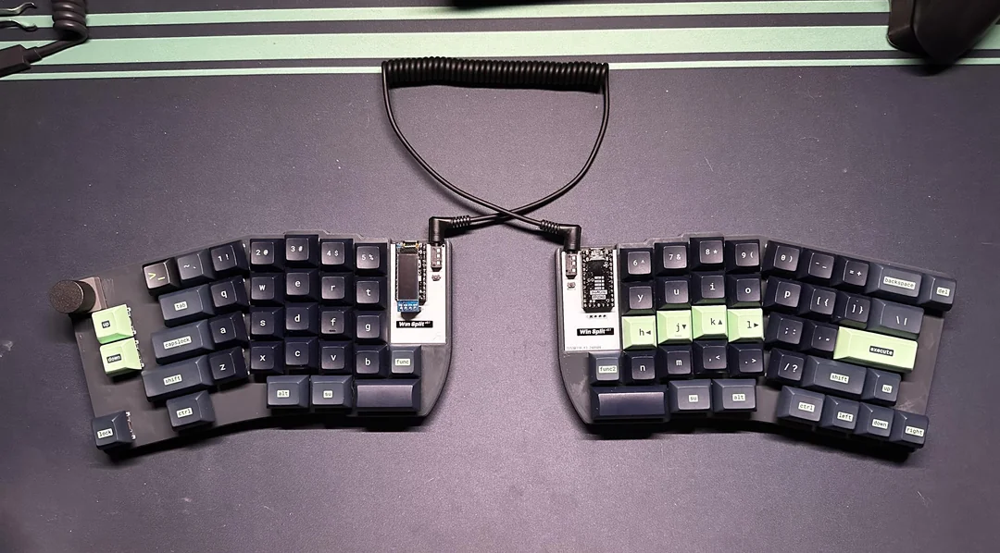

# Winsplit

Inspired by the Boardrun Bizarre and Red herring. I wanted to be able to use a normal keyset, so no full ortho, but split.

## Disclaimer

This is my first designed keyboard from the grounds up.
I'm not responsible for any damage caused by using this keyboard or any production of this keyboard that doesn't work.

## TODO

- [ ] Rotate 180º right-side OLED connector. Right now is not usable.
- [ ] Rotary encoder.
      As of now, it either works as a button when a normal switch is installed or as an encoder without button when the HS Skyloong encoder is installed.
- [ ] Make screw holes in PCB 4mm instead of 2.2mm
      So they are passthrougth and bottom plate can be directly screwed to top plate, like lily58 or Corne keyboards.

## Notes

- Function keys (Right of B and left of N) are hard to reach.
